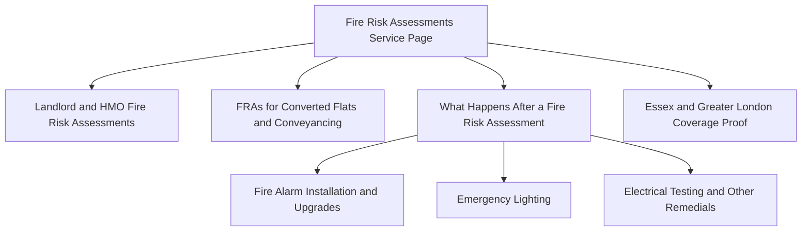

# Fire Risk Assessments Research Brief for J&L Security

## Executive summary

The attached brief is clear: J&L Security wants to test whether **fire risk assessments** should become a standalone web offering for Essex and Greater London, with the commercial logic that the assessment itself is delivered through an accredited contractor relationship while the resulting remedial works are delivered by J&L directly. The brief specifically targets landlords, flat owners involved in conveyancing, and commercial occupiers, and asks for keyword, SERP, competitor and content-structure analysis before any page is built. fileciteturn0file0L1-L19

The strongest conclusion from the evidence reviewed is that **FRAs warrant a dedicated service landing page, supported by tightly scoped informational content**. J&L already has the operational overlap, service footprint and trust signals to support this move: its current site promotes fire alarms across Essex and Greater London, states that fire risk assessments are already included within its fire-alarm proposition, and highlights SSAIB, CHAS, FIA and BAFE credentials. However, FRA is currently **buried inside the fire alarms service architecture**, which weakens its ability to rank for FRA-specific commercial intent and undervalues the cross-sell opportunity into alarm upgrades, emergency lighting and related remedials. citeturn7view0turn8view0

The competitive signal from the live pages reviewed is also consistent. Larger providers do **not** hide compliance services inside general fire-alarm copy; they separate them into distinct service pages. Chubb, for example, splits out **Fire Safety Survey**, **Fire Strategy Report**, **Emergency Lighting** and other adjacent services into dedicated URLs, and its enquiry flow includes **Romford** among local handling options, showing explicit London/Essex market relevance. BAFE, meanwhile, frames fire risk assessment as a specialist competency area under **SP205** and recommends users source an appropriately third-party certificated provider when they are not fully confident handling the assessment themselves. That means competence signalling is central to conversion in this market. citeturn40view0turn41view0turn21view1turn20view1

On that basis, the best strategic choice is **Option B: a dedicated FRA service page plus a small supporting resource cluster**. The service page should target the commercial head term and geo-modified variants; the supporting content should focus on the highest-intent long-tail questions that connect directly to revenue, especially **landlord/HMO obligations**, **converted flats and conveyancing**, and **what happens after an FRA identifies remedial actions**. That last theme is especially valuable because it matches J&L’s commercial model exactly and is explicitly called out in the brief. fileciteturn0file0L4-L15

A concise decision view is below.

| Decision area | Conclusion | Confidence |
|---|---|---|
| Should FRA sit only as a sub-point under Fire Alarms? | No. That under-signals the service and limits ranking/lead capture. | High |
| Should J&L build a dedicated FRA page? | Yes. | High |
| Should J&L also publish supporting FRA resources? | Yes, but only a small, tightly linked cluster. | High |
| Most valuable initial audiences | Landlords/HMOs, commercial premises, converted-flat / conveyancing cases. | High |
| Most defendable differentiator | “Assessment plus remedials delivery” under one local provider relationship. | High |
| Biggest risk | Weak competence messaging if the page does not explain the accredited delivery model and relevant standards clearly. | High |

## Brief extracted from the attachment

The attachment asks for a structured research report covering six areas: keyword research, SERP analysis, competitor identification, content-gap analysis, content-structure recommendation, and a regulatory note on current UK FRA obligations. It also specifies the relevant search themes, local variants, and target zones in **Essex** and **Greater London**, including Brentwood, Chelmsford, Romford, Basildon, Southend, Colchester, East London, Havering, Redbridge and Barking. fileciteturn0file0L21-L87

The business and editorial constraints are equally important. J&L is not positioning FRA as an isolated consultancy service; it wants FRA to become a doorway into **remedial works that it already delivers**, especially fire alarm installation/upgrades, emergency lighting and electrical testing. The page architecture therefore needs to do two jobs at once: win compliance-oriented assessment searches, and then convert those enquiries into higher-value remediation work. That linkage is central to the brief and should shape both page copy and internal linking. fileciteturn0file0L4-L15

The starting position on the live site is favourable. J&L currently markets itself as a local provider across Essex and Greater London, promotes same-day surveys, and lists accreditations including **SSAIB**, **CHAS**, **FIA** and **BAFE**. Its fire alarms page already states that it installs and services systems to relevant British Standards, serves HMOs, care homes, offices and residential blocks, and begins its fire-alarm process by reviewing an existing FRA or recommending one where needed. That means the SEO and conversion challenge is not service legitimacy; it is **service visibility and architecture**. citeturn7view0turn8view0

## Market demand and search opportunity

Because direct exports from subscription keyword tools were not available during this research run, the table below gives **directional analyst estimates** rather than tool-verified point values. These estimates should be validated in Semrush, Ahrefs or Google Ads before any budget forecasting, but they are robust enough for page-architecture decisions.

| Keyword cluster | Representative terms | Estimated UK searches per month | Estimated difficulty | Dominant intent | Local intent | Strategic reading |
|---|---|---:|---|---|---|---|
| Core FRA head terms | fire risk assessment; fire risk assessment near me; fire risk assessment Essex; fire risk assessment London | 1,200–3,500 combined | Medium to high | Commercial / informational mixed | Strong on geo and “near me” variants | Primary opportunity; needs a dedicated landing page |
| FRA acronym / related variants | FRA; fire safety assessment | 300–2,000 combined, but highly ambiguous | High | Mixed / ambiguous | Weak to moderate | Use as secondary copy only; do not lead with “FRA” |
| Landlord and HMO terms | fire risk assessment landlord; fire risk assessment rented property; fire risk assessment HMO; landlord fire safety obligations UK | 250–900 combined | Medium | Informational with commercial follow-on | Moderate when geo-modified | Strong support-content opportunity |
| Conveyancing / sale terms | fire risk assessment for flat sale; converted house; lease extension | 30–200 combined | Low to medium | Informational / advisory | Usually weak unless geo-combined | Niche but high-trust and high-conversion |
| Commercial compliance terms | fire risk assessment for business; care home; office; required by law | 250–800 combined | Medium | Commercial / informational mixed | Moderate | Good subsection / supporting-page targets |
| Remedial follow-on terms | fire alarm installation Essex; emergency lighting installation Essex; fire alarm upgrade; fire safety remedial works | 300–1,200 combined | Medium | Transactional | Strong on geo terms | Highest downstream revenue relevance |

The most important commercial lesson is that **not all search demand is equally valuable**. The generic head term “fire risk assessment” is important for credibility and coverage, but the more commercially efficient opportunities are the ones where the user has already narrowed their problem: **landlord**, **HMO**, **care home**, **office**, **Essex/London**, or **after the assessment, what remedials are needed**. Those users are closer to action and nearer to J&L’s actual revenue model. This aligns directly with the attachment’s target segments and J&L’s existing fire-alarm/remedial capability. fileciteturn0file0L9-L17 citeturn8view0

There is also an important prioritisation point around terminology. In this market, **“FRA” is poor as a lead keyword** even though it is common industry shorthand. It is too ambiguous and too dependent on prior knowledge. For SEO, it works better as secondary language inside a page already optimised around the full term “fire risk assessment”. By contrast, **geo-modified and audience-modified phrases** are much more likely to map neatly to a real enquiry and a service page.

The live site supports a local-first strategy. J&L already lists Essex and Greater London coverage on its homepage and has existing location references including Ilford, Romford, Chelmsford, Brentwood, Basildon, Barking and Redbridge. Its fire-alarm page goes further by listing local service combinations such as Brentwood, Chelmsford, Basildon and Canary Wharf. That means an FRA page can rank locally without inventing a totally new geographic framework. citeturn7view0turn8view0

The best initial keyword focus, therefore, is:

| Priority | Recommended target theme | Why it matters |
|---|---|---|
| Highest | fire risk assessment Essex / London | Head commercial service intent with geographic fit |
| Highest | fire risk assessment near me | Strong transactional local intent |
| Highest | fire risk assessment landlord / HMO | Directly tied to one of the brief’s clearest customer segments |
| High | fire risk assessment for business / office / care home | Clear compliance use case and strong B2B lead quality |
| High | what happens after a fire risk assessment / remedial works | Matches J&L’s monetisation model |
| Selective | flat sale / converted house / lease extension | Lower volume, but useful trust-building niche content |

## Competitive and SERP signals

A fully stable capture of current **Google UK page-one results** was not possible in this research run because search tooling returned inconsistent results for several fire-related head terms. For that reason, the conclusions below are based on a best-effort live-page review of J&L’s current site, national provider pages, and accreditation pages rather than a clean Google SERP export. That limitation affects precision, but not the strategic direction.

The strongest live-page comparison is between **J&L’s current treatment of FRA** and **Chubb’s service structure**. J&L currently references FRA inside the fire alarms service page, including an installation-process step that says it will review an existing fire risk assessment or recommend one. That is useful proof of operational relevance, but not enough to compete as a standalone compliance service. Chubb, by contrast, separates **Fire Safety Survey** and **Fire Strategy Report** into dedicated pages and surrounds them with adjacent services including alarms, emergency lighting, fire-door inspection and training. This indicates that in the market’s higher-authority tier, compliance services are treated as their own content assets instead of being hidden inside general product pages. citeturn8view0turn40view0turn41view0

The national benchmark also matters because it shows how users are trained to evaluate providers. Chubb’s fire-safety survey page says the purpose is ensuring premises are compliant, and its fire-strategy page ties the service to fire spread, warning and escape, evacuation documentation and broader business compliance. Those are not just technical descriptors; they are **conversion cues**. J&L should borrow that structure, but localise it more aggressively and make the remedials pathway clearer. citeturn40view0turn41view0

Competence signalling is another major SERP and conversion factor. BAFE’s fire-risk-assessment guidance is explicit that a quality FRA is a core obligation for non-domestic/commercial buildings, and that where the responsible person is not fully confident, an appropriately third-party certificated provider should be used. BAFE also frames **SP205** as the relevant scheme for life-safety fire risk assessment providers and provides a register for finding them. In practice, that means any J&L FRA page that does not explain **who performs the assessment, under what competency framework, and how the work is signed off** will look weaker than higher-trust competitors. citeturn21view1turn20view1

A concise competitor snapshot is below.

| Provider or competitive set | Service mix | Content structure | Geography signal | Trust / accreditation signal | Implication for J&L |
|---|---|---|---|---|---|
| **J&L Security current baseline** | Fire alarms, emergency lighting, compliance-oriented installations; FRA referenced inside fire-alarm process | FRA currently embedded as supporting copy, not a dedicated page | Explicit Essex and Greater London coverage; multiple live location references | SSAIB, CHAS, FIA, BAFE on-site | Strong operational fit, weak FRA visibility as a search target citeturn7view0turn8view0 |
| **Chubb Fire & Security** | Fire safety survey, fire strategy, alarms, emergency lighting, training, maintenance | Dedicated compliance pages plus adjacent service pages | National footprint; enquiry routing includes Romford | Large-scale national provider with strong authority signals | Confirms service-led architecture is the norm for stronger competitors citeturn39view0turn40view0turn41view0 |
| **BAFE SP205 provider ecosystem** | Specialist FRA competency set rather than one seller | Directory / accreditation / guidance model | UK-wide search register | SP205 positioned as relevant life-safety FRA scheme | J&L must explain accredited-delivery model clearly to compete credibly citeturn20view1turn21view1 |
| **Fire Protection Association** | Fire risk assessment service, risk surveying and training | Specialist fire-safety provider model | National, not local | Sector authority / training orientation | Illustrates trust competition from specialist non-installer brands citeturn38search0 |

The main content gaps are clearer than the exact competitor list:

| Gap | Why it matters | Recommended asset |
|---|---|---|
| **Landlord and HMO obligations in Essex/London** | The brief explicitly identifies landlords and HMOs; this is one of the cleanest intent-to-enquiry bridges. | Supporting guide linked from the main FRA service page |
| **Post-FRA remedials** | This is J&L’s commercial differentiator and an obvious user question after any failed or qualified assessment. | “What happens after a fire risk assessment?” page or major section |
| **Conveyancing / converted flats / lease-extension context** | Lower-volume, but high-trust and commercially attractive because buyers are often under time pressure. | One specialist resource article |
| **Competence explanation** | Buyers are increasingly trained to check provider competence and third-party certification. | Trust block on the service page explaining delivery model and standards |
| **Local proof** | Geo trust is important, but thin town pages are risky if they add no substance. | One strong area page with proof modules, not dozens of clones |

## Regulatory context and strategic implications

The core legal picture for England and Wales is that the **Regulatory Reform (Fire Safety) Order 2005** places responsibility on the responsible person to assess and manage fire risk, and BAFE describes a suitable and sufficient fire risk assessment as the foundation of fire-safety compliance for non-domestic/commercial buildings. BAFE also says that if a responsible person is not fully confident doing this themselves, they should use an appropriately third-party certificated provider, and it points users to **BAFE SP205** as the competency scheme for life-safety fire risk assessment. citeturn38search4turn21view1turn20view1

For residential blocks, the regime tightened after Grenfell. The **Fire Safety Act 2021** clarified the application of the Fire Safety Order in buildings containing two or more domestic premises, including external walls and flat entrance doors. The **Fire Safety (England) Regulations 2022** then introduced further duties for responsible persons in multi-occupied residential buildings, and the surfaced summary notes that those regulations came into force on **26 January 2023**. The **Building Safety Act 2022** added a wider higher-risk building framework. citeturn32search2turn29search7turn29search10

HMOs remain a critical segment. The surfaced HMO summary states that a **large HMO** in England and Wales requires a licence when at least five tenants from more than one household share facilities. That does not mean every landlord search is identical, but it does reinforce why “landlord” and “HMO” are not marginal keyword themes; they are core compliance-related user needs and should be explicitly addressed in content. citeturn27search4

One important wording caution: the attachment identifies **owners of flats in converted houses being sold** as a target segment because FRAs are often needed during conveyancing. That is commercially real, but it should not be presented as a universal statutory rule in page copy. It is better framed as a **common transaction or lender/solicitor requirement**, unless J&L obtains legal review and wants to cite specific authorities. fileciteturn0file0L9-L17

For copywriting purposes, the safest factual framing for the future service page is:

- FRAs are a core fire-safety compliance requirement for many non-domestic and multi-occupied settings. citeturn21view1turn38search4
- Landlords, HMO operators, block managers and commercial occupiers frequently need them. fileciteturn0file0L9-L17 citeturn27search4turn29search7
- After an FRA, remedial works may be required, including detection/alarm improvements, emergency-lighting changes and related compliance upgrades. fileciteturn0file0L4-L15 citeturn21view2
- Provider competence matters, and third-party certification is a strong trust signal. citeturn21view1turn20view1

## Recommended content architecture

The best-fit structure is **Option B: a dedicated FRA service page plus supporting articles**.

| Option | Expected SEO benefit | Content effort | Suitability for J&L | Recommendation |
|---|---|---|---|---|
| **Dedicated FRA service page only** | Medium. Captures core transactional terms, but leaves informational long-tail and trust questions uncovered. | Low | Better than the current setup, but incomplete. | Viable minimum, not best |
| **Dedicated FRA page plus supporting resources** | High. Covers head terms, long-tail intent, trust building and internal links into remedials. | Medium | Best match for J&L’s local coverage, accreditations and remediation model. | **Recommended** |
| **Add FRA only as a sub-service within Fire Alarms** | Low to medium. Easy to implement, but under-signals the service and limits query reach. | Low | Too narrow for the brief’s audience mix. | Not recommended as the main solution |

This recommendation follows directly from the attachment’s requirement to evaluate whether FRA deserves a dedicated service page, a resource section, or both; from J&L’s current positioning, where FRA is present but subordinate; and from the live competitor pattern, where stronger providers separate compliance services into distinct landing pages. fileciteturn0file0L16-L19 citeturn8view0turn40view0turn41view0

A practical structure would look like this:

### Recommended page set

| Asset | Purpose | Primary intent | Notes |
|---|---|---|---|
| **Main FRA service page** | Rank for the core commercial terms and convert enquiries | Commercial / transactional | Should explain who the service is for, what is included, how the accredited delivery model works, and how J&L handles remedials |
| **Landlord and HMO guide** | Capture informational searches that lead to compliance enquiries | Informational → commercial | Include Essex/London references where genuine |
| **Converted flats / conveyancing guide** | Address a niche but valuable use case named in the brief | Informational / advisory | Strong trust play; ideal for solicitors, sellers and managing agents |
| **After the FRA / remedials guide** | Convert assessment demand into installation and upgrade demand | Informational → transactional | This is J&L’s clearest differentiator |
| **Internal-link refresh on existing Fire Alarms page** | Pass relevance and support remedial conversion | Commercial | Essential because the current fire page already references FRA and local fire-alarm compliance work citeturn8view0 |

### What the main FRA page should contain

The page should not be a generic explainer. It should be a **local commercial landing page** with the following structure:

1. **Clear H1:** Fire Risk Assessments in Essex and Greater London  
2. **Audience sections:** landlords, HMOs, commercial premises, converted flats / conveyancing  
3. **What is included:** survey scope, report, findings, priority actions, follow-up support  
4. **Competence block:** explain the accredited contractor relationship and any certification framework used  
5. **Remedials block:** fire alarms, emergency lighting, testing and compliance upgrades delivered by J&L  
6. **Coverage proof:** Brentwood base and Essex / Greater London areas already served  
7. **FAQ block:** legal requirement, who needs an FRA, how often to review, what happens if problems are found  
8. **Strong CTA:** survey / quote / call-back  

The page should also pull through J&L’s current proof points already visible elsewhere on the site: established since 2011, Essex / Greater London coverage, fire-alarm standards knowledge, HMOs and blocks experience, and existing fire-safety credentials. citeturn7view0turn8view0

### Immediate implementation priorities

| Timing | Action | Why |
|---|---|---|
| Immediate | Publish the dedicated FRA service page | Fastest way to correct the current visibility gap |
| Immediate | Add FRA links from homepage, Fire Alarms page and relevant location pages | J&L already has local and fire-safety authority to pass internally citeturn7view0turn8view0 |
| Next | Publish the landlord/HMO and post-FRA remedials articles | Best balance of demand and commercial value |
| Next | Add trust blocks around accreditation, delivery model and report process | Required for conversion in a competence-sensitive market |
| Later | Add the conveyancing / converted-flats resource and local proof modules | Helps differentiate beyond generic compliance copy |

## Appendix of sources and limitations

The highest-confidence sources used in this brief were the **attached prompt**, J&L’s current website, BAFE guidance pages, and live Chubb compliance pages. These sources were most useful because they directly addressed J&L’s scope, current positioning, accreditation/competence expectations, and competitor content structure. fileciteturn0file0L1-L87 citeturn7view0turn8view0turn20view1turn21view1turn21view2turn39view0turn40view0turn41view0

The legal context was supplemented with surfaced summaries for the **Regulatory Reform (Fire Safety) Order 2005**, **Fire Safety Act 2021**, **Fire Safety (England) Regulations 2022**, **Building Safety Act 2022**, and HMO licensing summaries. These were sufficient for strategic content planning, but **any final website legal copy should still be checked against the underlying legislation or a specialist adviser before publication**. citeturn38search4turn32search2turn29search7turn29search10turn27search4

There are three material limitations. First, **tool-verified keyword volumes and difficulty scores** were not available in this run, so the demand estimates in the keyword table are directional rather than exported from Semrush/Ahrefs/Ads. Second, a clean **Google UK page-one SERP capture** for several fire-related terms was not consistently reproducible via the available search tooling, so the SERP section is a live-page review rather than a strict page-one ranking audit. Third, because of that same limitation, the list of **Essex/London SME competitors** is partial; the competitive conclusions are strongest at the architecture and trust-signal level, and weaker at the exact local-SME enumeration level.

Despite those limits, the decision itself is clear: **J&L should launch a dedicated Fire Risk Assessments service page and support it with a focused content cluster built around landlords/HMOs, conveyancing use cases, and post-FRA remedials.**